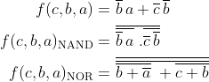

## GitHub link to my Digital-electronics-1 repository
https://github.com/bfbl/Digital-electronics-1

## Verification of De Morgan's laws of function f(c,b,a)
[link to my code on EDA](https://www.edaplayground.com/x/Qw2f)


```LaTeX
\begin{align*}
    f(c,b,a) =&~ \overline{b}\,a + \overline{c}\,\overline{b}\\
    f(c,b,a)_{\textup{NAND}} =&~ \overline{\overline{\overline{b}\,a}\ .\overline{\overline{c}\,\overline{b}}}\\\
    f(c,b,a)_{\textup{NOR}} =&~ \overline{\overline{ \overline{b+\overline{a}}\ + \overline{c+b}}}\\\
\end{align*}
```

| **c** | **b** |**a** | **f(c,b,a)** |
| :-: | :-: | :-: | :-: |
| 0 | 0 | 0 | 1 |
| 0 | 0 | 1 | 1 |
| 0 | 1 | 0 | 0 |
| 0 | 1 | 1 | 0 |
| 1 | 0 | 0 | 0 |
| 1 | 0 | 1 | 1 |
| 1 | 1 | 0 | 0 |
| 1 | 1 | 1 | 0 |


```VHDL
------------------------------------------------------------------------
--
-- Example of basic OR, AND, XOR gates.
-- Nexys A7-50T, Vivado v2020.1, EDA Playground
--
-- Copyright (c) 2019-2020 Boris Fabula
-- Dept. of Radio Electronics, Brno University of Technology, Czechia
-- This work is licensed under the terms of the MIT license.
--
------------------------------------------------------------------------

library ieee;               -- Standard library
use ieee.std_logic_1164.all;-- Package for data types and logic operations

------------------------------------------------------------------------
-- Entity declaration for basic gates
------------------------------------------------------------------------
entity gates is
    port(
        a_i     : in  std_logic;         -- Data input
        b_i     : in  std_logic;         -- Data input
        c_i     : in  std_logic;         -- Data input
        f_o     : out std_logic;         -- given func
        fnand_o : out std_logic;         -- func in nand
        fnor_o  : out std_logic          -- func in nor
    );
end entity gates;

------------------------------------------------------------------------
-- Architecture body for basic gates
------------------------------------------------------------------------
architecture dataflow of gates is
begin
    f_o     <= ((not b_i) and a_i) or ((not c_i) and (not b_i)); --given function
    fnand_o <= (not b_i nand a_i) nand (not c_i nand not b_i);   --func using only nand
    fnor_o  <= not((b_i nor not a_i) nor (c_i nor b_i));         --func using only nor
end architecture dataflow;
```

## Verification of Distributive laws
[link to my code on EDA](https://www.edaplayground.com/x/W_Lu)


The graph above shows basic Boolean postulates


The graph above shows the distributive laws, where the suffix 'e' means it's the equivalent of the other expression.

```VHDL
------------------------------------------------------------------------
--
-- Example of basic OR, AND, XOR gates.
-- Nexys A7-50T, Vivado v2020.1, EDA Playground
--
-- Copyright (c) 2019-2020 Boris Fabula
-- Dept. of Radio Electronics, Brno University of Technology, Czechia
-- This work is licensed under the terms of the MIT license.
--
------------------------------------------------------------------------

library ieee;               -- Standard library
use ieee.std_logic_1164.all;-- Package for data types and logic operations

------------------------------------------------------------------------
-- Entity declaration for basic gates
------------------------------------------------------------------------
entity gates is
    port(
        x_i          : in  std_logic;         -- Data input
        y_i          : in  std_logic;         -- Data input
        z_i          : in  std_logic;         -- Data input
        f1_o         : out std_logic;  
        f2_o         : out std_logic;         
        f3_o         : out std_logic;
        f4_o         : out std_logic;
        fdistr1_o    : out std_logic;
        fdistr1e_o   : out std_logic;
        fdistr2_o    : out std_logic;
        fdistr2e_o   : out std_logic
    );
end entity gates;

------------------------------------------------------------------------
-- Architecture body for basic gates
------------------------------------------------------------------------
architecture dataflow of gates is
begin
    f1_o       <= x_i  and  not x_i;
    f2_o       <= x_i  or   not x_i;
    f3_o       <= x_i  or   x_i or  x_i;        
    f4_o       <= x_i  and  x_i and x_i;
    fdistr1_o  <= (x_i and y_i) or  (x_i and z_i);
    fdistr1e_o <= x_i  and (y_i or  z_i);
    fdistr2_o  <= (x_i or  y_i) and (x_i or z_i);
    fdistr2e_o <= x_i  or  (y_i and z_i);
end architecture dataflow;

```