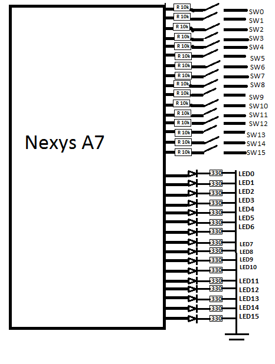
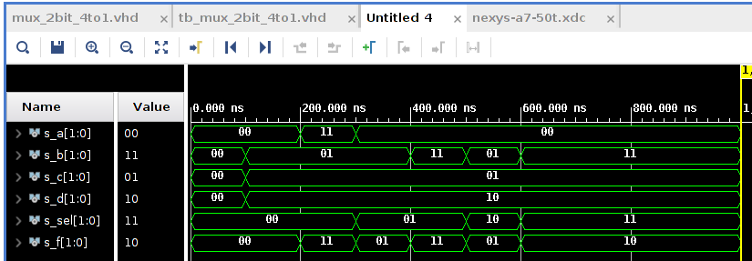

## Vivado tutorial

1. After clicking on Create Project, enter the name and location of the project
2. Next, for most of the projects select RTL
3. Next, in Add sources click Create File, select type VHDL and enter name
4. Next, skip adding Constraints. If needed it can always be added later
5. Next, click on Boards tab and find Nexys A7-50T. It is necessary to add it first - [step 5](https://github.com/tomas-fryza/Digital-electronics-1/wiki/How-to-Install-Vivado-2020.1-on-Linux)
6. Next, and finish the initialization of the project.
7. In the popup window there's no need to define I/O, just click OK. We'll deine them in the code
8. Focus on the Sources window. In Design Sources there is the main program file
9. Click on the plus sign above and select create simulation source. This is the testbench program. Next, Create file just like in the step 3 and 7. The newly created file can be accessed in Simulation Sources
10. If necessary, XDC constraint file can be added in the same way
11. To run simulation, press Run Simulation in Flow Navigator window, and select Behavioral
12. In Simulation window find the settings button (cogwheel) to adjust the plot and values (HEX/DEC)
  
## Nexys A7 LEDs & Switches diagram
  

  
## Project tasks
  

  
``` VHDL
p_stimulus : process
    begin
        -- Report a note at the begining of stimulus process
        report "Stimulus process started" severity note;


        -- First test values
        s_d <= "00"; s_c <= "00"; s_b <= "00"; s_a <= "00";
        s_sel <= "00";
        wait for 100 ns;
        
        s_d <= "10"; s_c <= "01"; s_b <= "01"; s_a <= "00";
        s_sel <= "00";
        wait for 100 ns;
        
        s_d <= "10"; s_c <= "01"; s_b <= "01"; s_a <= "11";
        s_sel <= "00";
        wait for 100 ns;
        
        s_d <= "10"; s_c <= "01"; s_b <= "01"; s_a <= "00";
        s_sel <= "01";
        wait for 100 ns;
        
        s_d <= "10"; s_c <= "01"; s_b <= "11"; s_a <= "00";
        s_sel <= "01";
        wait for 100 ns;
        
        s_d <= "10"; s_c <= "01"; s_b <= "01"; s_a <= "00";
        s_sel <= "10";
        wait for 100 ns;
        
        s_d <= "10"; s_c <= "01"; s_b <= "11"; s_a <= "00";
        s_sel <= "11";
        wait for 100 ns;     
   
        -- Report a note at the end of stimulus process
        report "Stimulus process finished" severity note;
        wait;
    end process p_stimulus;
```
  
``` VHDL
architecture Behavioral of mux_2bit_4to1 is
begin

    f_o <= a_i when (sel_i = "00") else
           b_i when (sel_i = "01") else
           c_i when (sel_i = "10") else
           d_i;


    -- WRITE "GREATER" AND "EQUALS" ASSIGNMENTS HERE


end architecture Behavioral;
```
