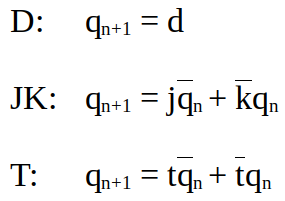
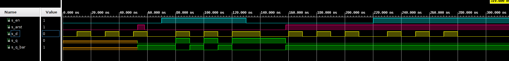
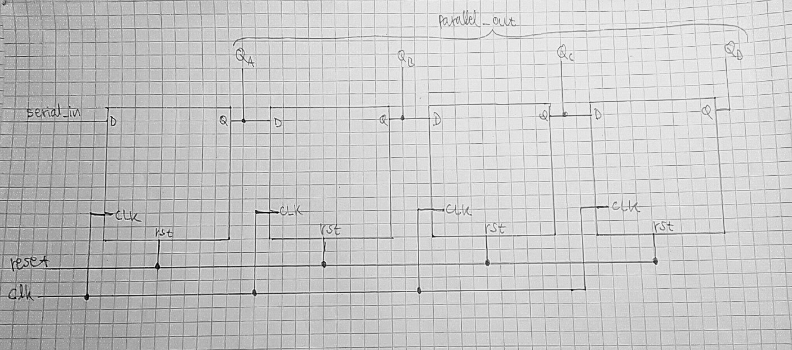

# **TASK 1**: Preparation tasks  
* ### Characteristic equations and completed tables for D, JK, T flip-flops.
    
    **D flip flop:**
   | **clk** | **d** | **q(n)** | **q(n+1)** | **Comments** |
   | :-: | :-: | :-: | :-: | :-- |
   |  | x | qn | ~qn | Remember/hold values, no change |
   |  | x | qn | ~qn | Remember/hold values, no change |
   |  | 0 | 0 | 1 | Input signal is sampled at the rising edge ofclkand stored to FF |
   |  | 1 | 1 | 0 | Input signal is sampled at the rising edge ofclkand stored to FF |

    **JK flip flop:**
   | **clk** | **j** | **k** | **q(n)** | **q(n+1)** | **Comments** |
   | :-: | :-: | :-: | :-: | :-: | :-- |
   |  | 0 | 0 | 0 | 0 | No change |
   |  | 0 | 0 | 1 | 1 | No change |
   |  | 0 | 1 | 0 | 0 | Reset |
   |  | 0 | 1 | 1 | 0 | Reset |
   |  | 1 | 0 | 0 | 1 | Set |
   |  | 1 | 0 | 1 | 1 | Set |
   |  | 1 | 1 | 0 | 1 | Toggle |
   |  | 1 | 1 | 1 | 0 | Toggle |
    
    **T flip flop:**
   | **clk** | **t** | **q(n)** | **q(n+1)** | **Comments** |
   | :-: | :-: | :-: | :-: | :-- |
   |  | 0 | 0 | 0 | No change |
   |  | 0 | 1 | 1 | No change |
   |  | 1 | 0 | 1 | Invert (Toggle) |
   |  | 1 | 1 | 0 | Invert (Toggle) |
  
# **TASK 2**: D latch.
* ### VHDL code listing of the process `p_d_latch` with syntax highlighting,
    ```VHDL
    p_d_latch : process (d, arst, en)
    begin
        if (arst = '1') then
            q     <= '0';
            q_bar <= '1';
            
        elsif (en = '1') then
            q     <=  d;
            q_bar <=  not d;
            
        end if;
    end process p_d_latch;
    ```
* ### Listing of VHDL reset and stimulus processes from the testbench `tb_d_latch.vhd` file with syntax highlighting and asserts,
    ``` VHDL
    p_reset_gen : process
    begin
        s_arst <= '0';
        wait for 53 ns;
        
        s_arst <= '1';
        wait for 5 ns;
        assert(s_q = '0' and s_q_bar = '1');
        report "assert2" severity error; 
        
        s_arst <= '0';       
        wait for 100 ns;
        s_arst <= '1';
        
        wait;
    end process p_reset_gen;

    p_stimulus : process
    begin
        report "Stimulus process started" severity note;
        s_en     <= '0';
        s_d      <= '0';
        
        wait for 10 ns;
        s_d      <= '1';
        wait for 10 ns;
        s_d      <= '0';
        wait for 10 ns;
        s_d      <= '1';
        wait for 10 ns;
        s_d      <= '0';
        wait for 10 ns;
        s_d      <= '1';
        wait for 10 ns;
        s_d      <= '0';
        wait for 10 ns;
        
        s_en <= '1';
        
        wait for 3 ns;
        assert(s_q = '0' and s_q_bar = '1');
        report "assert1" severity error; 
        
        wait for 7 ns;
        s_d      <= '1';
        wait for 10 ns;
        s_d      <= '0';
        wait for 10 ns;
        s_d      <= '1';
        wait for 10 ns;
        s_d      <= '0';
        wait for 10 ns;
        s_d      <= '1';
        wait for 10 ns;
        s_en <= '0';
        wait for 10 ns;
        s_d      <= '0';
        wait for 10 ns;
        

        wait for 10 ns;
        s_d      <= '1';
        wait for 10 ns;
        s_d      <= '0';
        wait for 10 ns;
        s_d      <= '1';
        wait for 10 ns;
        s_d      <= '0';
        wait for 10 ns;
        s_d      <= '1';
        wait for 10 ns;
        s_d      <= '0';
        wait for 10 ns;
        
        s_en <= '1';
        
        wait for 10 ns;
        s_d      <= '1';
        wait for 10 ns;
        s_d      <= '0';
        wait for 10 ns;
        s_d      <= '1';
        wait for 10 ns;
        s_d      <= '0';
        wait for 10 ns;
        s_d      <= '1';
        wait for 10 ns;
        s_d      <= '0';
        wait for 10 ns;
        
        report "Stimulus process finished" severity note;
        wait;
    end process p_stimulus;
    ```
* ### Screenshot with simulated time waveforms; The full functionality of the entity must be verified.
    


# **TASK 3**: Flip-flops.
* ### VHDL code listing of the processes `p_d_ff_arst`, `p_d_ff_rst`, `p_jk_ff_rst`, `p_t_ff_rst` with syntax highlighting,
    ``` VHDL

    ```
    ``` VHDL

    ```
    ``` VHDL

    ```
    ``` VHDL

    ```
* ### Listing of VHDL _clock_, _reset_ and _stimulus_ processes from the testbench files with syntax highlighting and _asserts_,
    ``` VHDL

    ```
* ### Screenshot with simulated time waveforms; always display all inputs and outputs. The full functionality of the entities must be verified.
    

# **TASK 4**: Shift register. 
* ### Image of the shift register schematic. The image can be drawn on a computer or by hand.
    


